<p align="center">
  
</p>

<h1 align="center">Plurality</h1>

<p align="center"><i>AI agentic assistant you can see and steer in real time</i></p>

<p align="center">
  <a href="https://flutter.dev"></a>
  <a href="https://go.dev"></a>
  <a href="LICENSE"></a>
  
  
</p>

<p align="center">
  <a href="https://cosmos-cloud.io">
    
  </a>
</p>

A free, self-hosted AI assistant that you can see in action, steer in real time, and easily debug.

Sort emails, messages, calendar... Virtually connect anything to it, with no config: just ask the AI to set it up for you

 * Conversation and agents workflow in one UI
 * Fully open-source, free, and local
 * (almost) Any models from (almost) any providers
 * Sandboxed agents with full control over their virtual environment (They can setup software in their VM)
 * Tool calls, MCP, Image generation, Shell execution, skills and more (compatible with openClaw skills)
 * Custom harness with tool approval
 * Attach a folder to any conversation — code in it like Claude Code, draft documents, or let it organize your desktop
 * Remote clients (vibe code on your PC from your phone)
 * Native application (mobile and desktop) and web
 * More features such as: CRON Scheduler, Webhook interception, Agent preset library, etc...


<p align="center">
  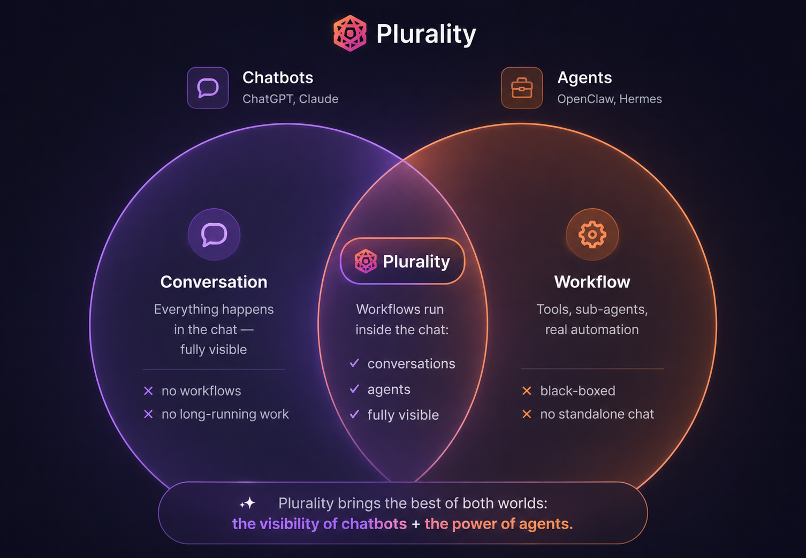
</p>


A chatbot conversation happens on the spot. You type, it answers, and when you close the tab, everything stops — nothing runs without you. Agents are different in kind, not degree: you give one a goal and it keeps working after you walk away, for minutes, hours, or days. It calls tools, monitors things, spawns sub-agents that work in parallel. That's real capability — but most of the work now happens while you're not there, in a place you can't see. Platforms like OpenClaw bolt a chat on top, but the chat is just a window the agent occasionally waves through.

Plurality covers both. Need a quick answer? Spawn a plain conversation — instant, disposable, nothing running behind it. Need work done over time? The long-running tasks unfold inside a fully featured conversation you can open at any moment to watch, stop, steer, or debug. Other platforms let the agent text you updates; Plurality shows you every inference the agent made, as a conversation. Even sub-agents appear as nested sub-conversations under the agent that spawned them.


<p align="center">
  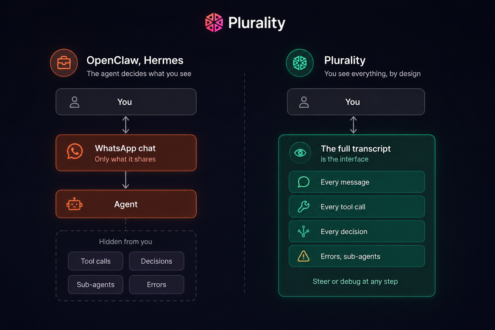
</p>


## Highlights


- **See every action.** Each tool call shows up inline with its arguments. File edits
  render as git-style diffs. Long jobs show a live checklist. Timers count down. Click
  any step to open the raw call and its result.
- **Steer in real time.** Hit stop to cancel an in-flight run. Require approval before
  a tool executes. Switch models mid-conversation.
- **Watch the whole tree.** Agents can launch parallel sub-agents; the UI nests them
  under their parent with live "typing / running *tool*" status so you can follow a
  fan-out without losing the thread.
- **Know the cost.** Every message carries its token counts and dollar cost. No
  guessing where the bill came from.
- **Any model, one config.** Routes through a local [LiteLLM](litellm.md) proxy, so
  OpenAI, Anthropic, Gemini, Fireworks, and others all work from a single YAML file —
  no provider lock-in, no hardcoded model list, keys stay on your box.
- **Real agents.** A server-side tool loop lets the assistant run shell commands, read
  and write files, search the web, generate images, and spin up parallel sub-agents.
- **Background work.** Schedule prompts with cron, or trigger them over HTTP with
  signed webhooks — the assistant keeps working when you're not watching.
- **Multimodal.** Text, vision, image generation/editing, speech-to-text, and TTS,
  gated per-model by capability.
- **Presets / Mini-Apps.** Save a system prompt + model + tool set as a reusable
  one-tap assistant.
- **Hybrid search.** Full-text (BM25) and semantic vector search over your whole
  history, merged into one ranking.
- **MCP support.** Plug in any Model Context Protocol server to add tools.
- **One client, everywhere.** A single Flutter app runs on web, desktop (Windows/
  macOS/Linux), and mobile (iOS/Android).
- **Auth your way.** Local accounts or OpenID/OIDC (Authentik, Keycloak, Auth0,
  Google, …) via PKCE — see [openid.md](openid.md).
- **Self-contained.** Per-user SQLite, no external database to run.

## Gallery

<table>
  <tr>
    <td align="center" valign="top">
      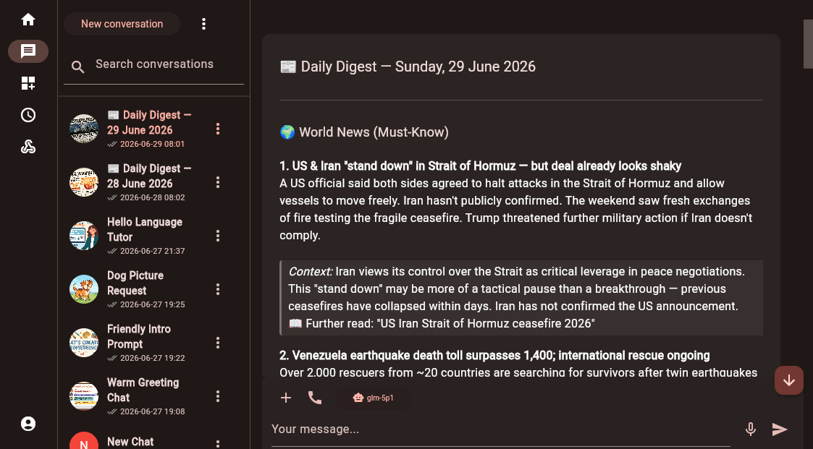<br>
      <sub>🗂️ &nbsp;Conversations and agents, one UI</sub>
    </td>
    <td align="center" valign="top">
      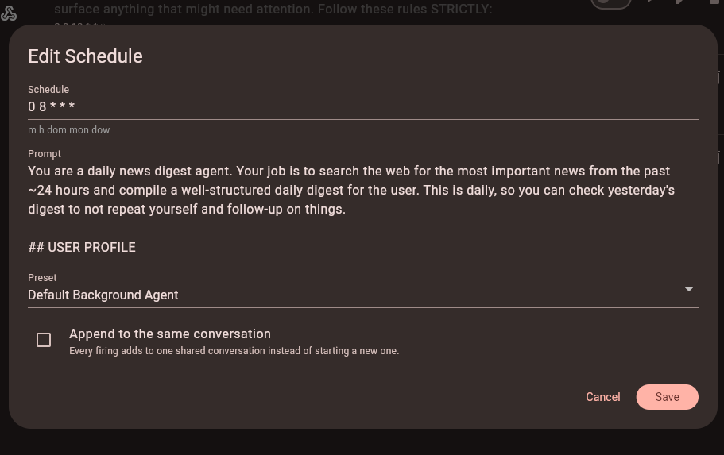<br>
      <sub>⏰ &nbsp;Schedule prompts with cron</sub>
    </td>
  </tr>
  <tr>
    <td align="center" valign="top">
      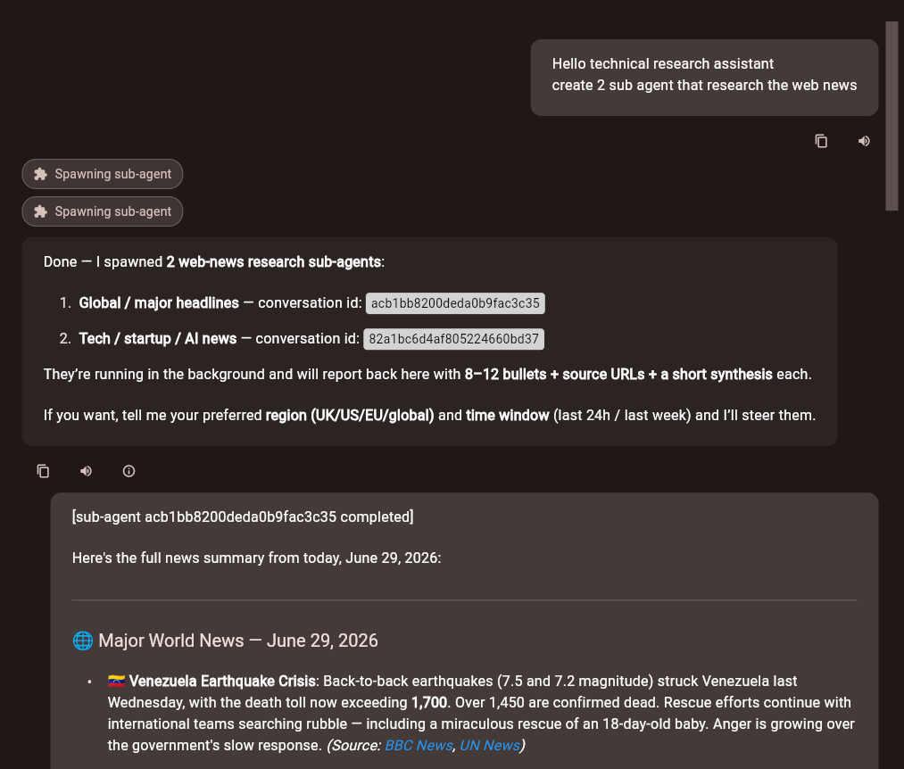<br>
      <sub>🤖 &nbsp;Spawn background sub-agents</sub>
    </td>
    <td align="center" valign="top">
      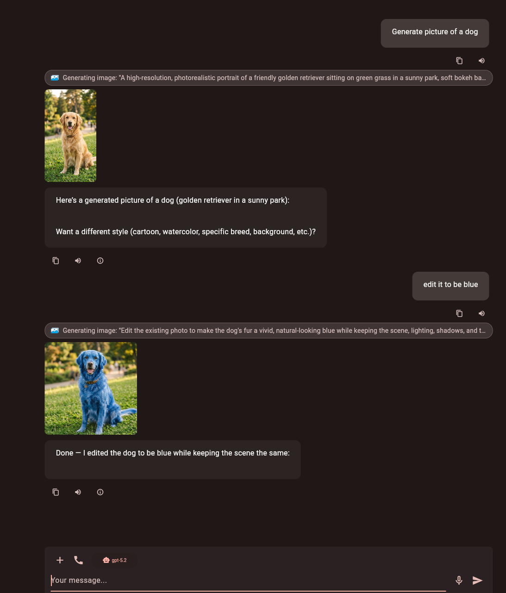<br>
      <sub>🎨 &nbsp;Generate &amp; edit images inline</sub>
    </td>
    <td align="center" valign="top">
      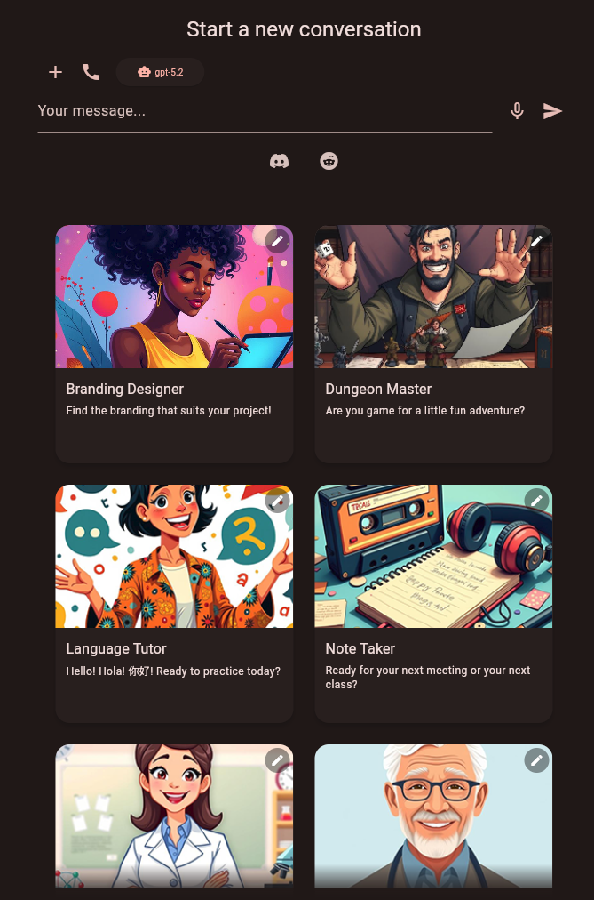<br>
      <sub>✨ &nbsp;One-tap preset mini-apps</sub>
    </td>
  </tr>
  <tr>
    <td align="center" valign="top">
      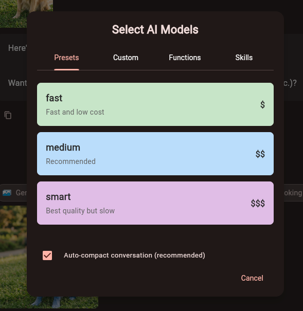<br>
      <sub>⚙️ &nbsp;Pick a model preset by cost</sub>
    </td>
    <td align="center" valign="top">
      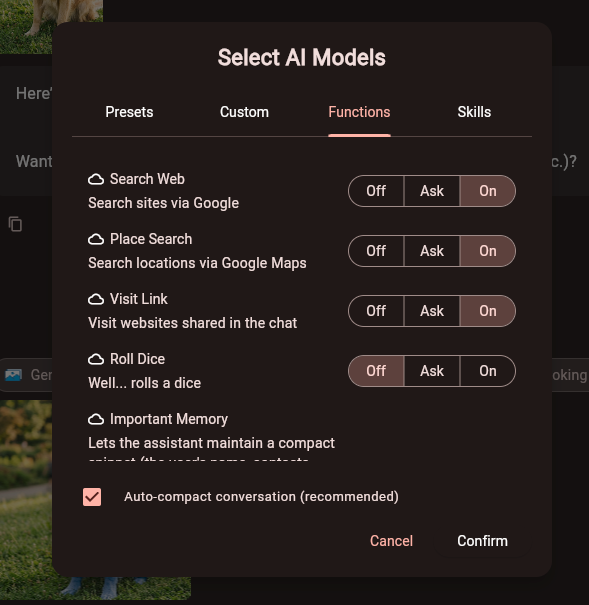<br>
      <sub>🔐 &nbsp;Per-tool approval (Off / Ask / On)</sub>
    </td>
    <td align="center" valign="top">
      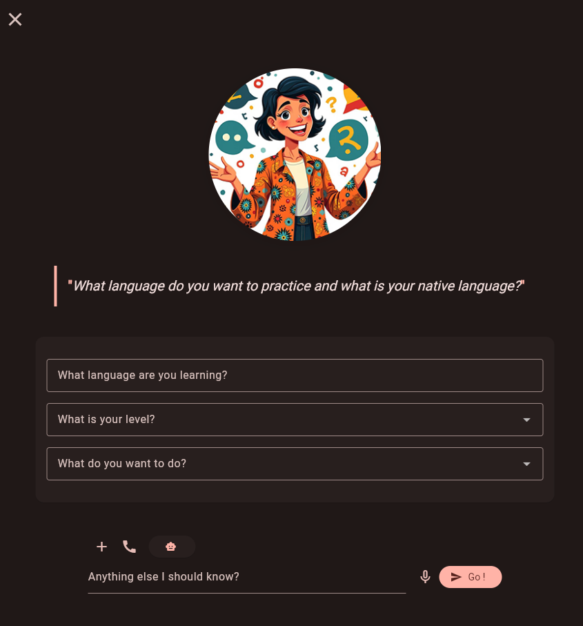<br>
      <sub>🚀 &nbsp;Guided preset launch</sub>
    </td>
    <td align="center" valign="top">
      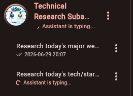<br>
      <sub>🌿 &nbsp;Nested sub-conversations</sub>
    </td>
  </tr>
</table>

## Quickstart

From Cosmos cloud, install in one click: [install](https://cosmos-cloud.io/proxy#cosmos-ui/market-listing/cosmos-cloud/Plurality)

Or from your server's terminal (This assumes you are using Open Router, see [deployments](./deployment.md) and [litellm.md](litellm.md) for details on how to setup your AI models accesses)

```bash
docker run -d --name plurality \
  -p 8090:8090 \
  -v plurality-users:/app/users-data \
  -v plurality-data:/app/data \
  -e OPENROUTER_API_KEY=xxxxx \
  -e INIT_ADMIN_USER=admin \
  -e INIT_ADMIN_PASSWORD=change-me \
  azukaar/plurality
```

```yml
services:
  plurality2:
    image: azukaar/plurality
    container_name: plurality2
    ports:
      - "8090:8090"
    volumes:
      - plurality-data:/app/data
      - plurality-users:/app/users-data
    environment:
      - OPENROUTER_API_KEY=xxxxx
      - INIT_ADMIN_USER=admin
      - INIT_ADMIN_PASSWORD=change-me
    restart: unless-stopped

volumes:
  plurality-data:
  plurality-users:
```

Then open <http://<ip>:8090> or your domain and log in with the admin credentials you set.
Before the assistant can answer anything, point it at a model — edit
`data/litellm_config.yaml` and add your provider key. See **[deployment.md](deployment.md)**
for the full walkthrough.

## Documentation

- **[doc.md](doc.md)** — how to use each feature.
- **[deployment.md](deployment.md)** — self-hosting: Docker, volumes, env vars, users.
- **[litellm.md](litellm.md)** — configuring which models are available.
- **[openid.md](openid.md)** — single sign-on setup.

## Stack

Go backend (Gorilla Mux, SQLite + sqlite-vec) · Flutter client · LiteLLM for model
routing · packaged as a single Docker image.


## Contributing

Contributions are welcome, but please open a discussion before implementing features!
 And avoid vibe-coding features with 0 review/testing please. 